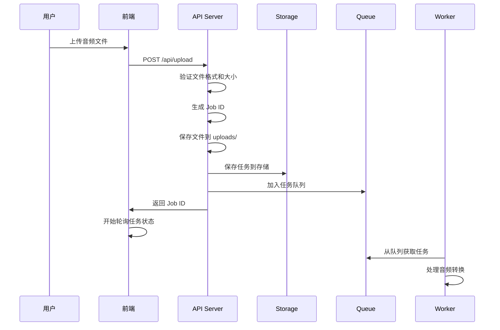
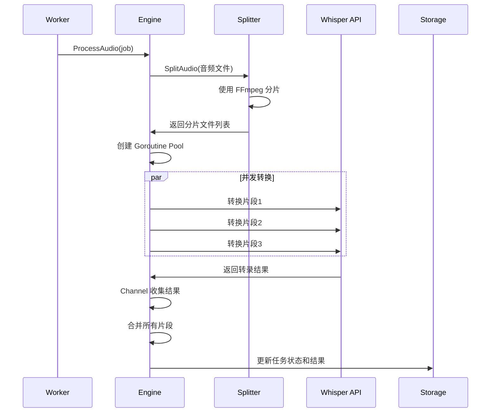
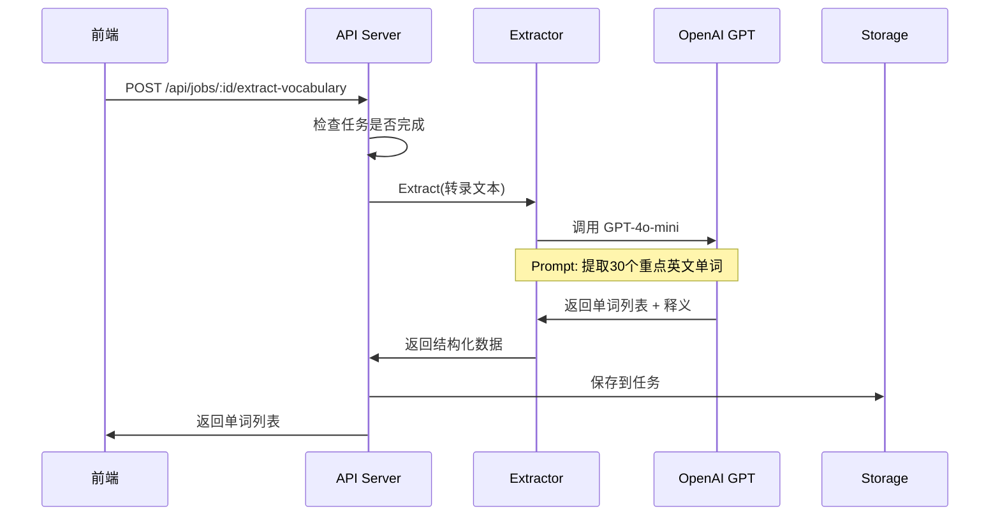
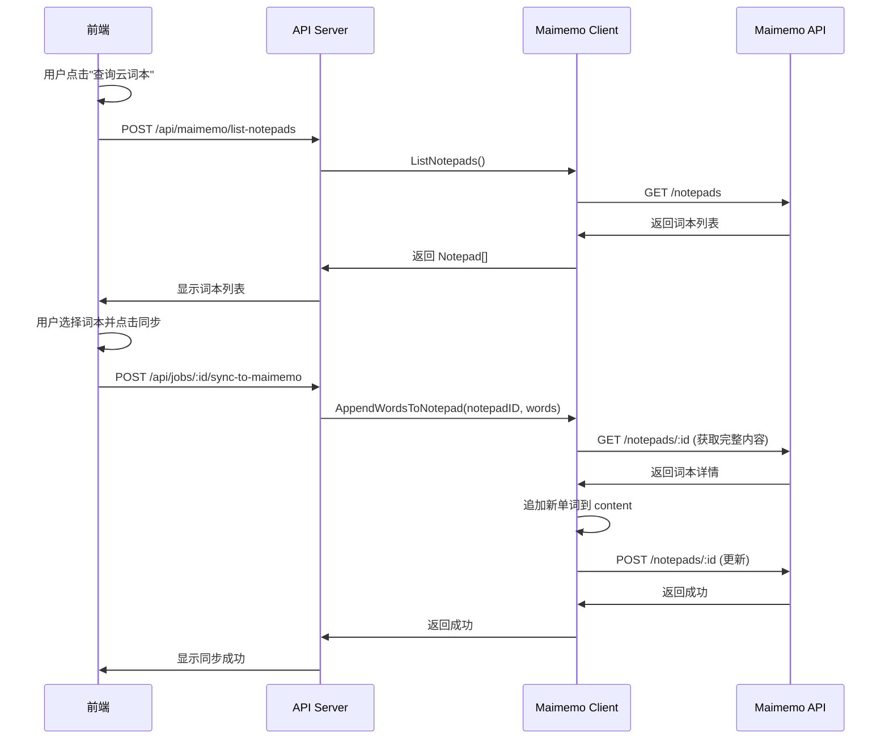

# VoiceFlow 架构与代码流程分析

## 📋 目录

1. [系统架构](#系统架构)
2. [核心流程](#核心流程)
3. [代码结构详解](#代码结构详解)
4. [关键技术点](#关键技术点)
5. [API 接口](#api-接口)
6. [前端实现](#前端实现)

---

## 系统架构

### 整体架构图

```
┌─────────────┐
│   前端页面   │ (index.html)
│  上传 + 展示 │
└──────┬──────┘
       │ HTTP
       ↓
┌─────────────────────────────────────┐
│          Gin Web 框架                │
│  ┌─────────────────────────────┐   │
│  │   API 路由 (cmd/api/main.go) │   │
│  └─────────────────────────────┘   │
└──────┬──────────────────────────────┘
       │
       ↓
┌──────────────────────────────────────┐
│         业务逻辑层                    │
│  ┌──────────┐  ┌──────────────┐    │
│  │  Storage │  │    Queue     │    │
│  │ 任务存储  │  │  任务队列     │    │
│  └──────────┘  └──────────────┘    │
└──────┬──────────────────────────────┘
       │
       ↓
┌──────────────────────────────────────┐
│          Worker 处理层                │
│  ┌────────────────────────────────┐ │
│  │  TranscriptionEngine (核心)    │ │
│  │  - 音频分片 (FFmpeg)            │ │
│  │  - Goroutine Pool 并发转换     │ │
│  │  - Channel 结果收集             │ │
│  └────────────────────────────────┘ │
└──────┬──────────────────────────────┘
       │
       ↓
┌──────────────────────────────────────┐
│         外部服务调用                  │
│  ┌───────────┐  ┌──────────────┐   │
│  │  OpenAI   │  │   Maimemo    │   │
│  │  Whisper  │  │   开放 API    │   │
│  └───────────┘  └──────────────┘   │
└──────────────────────────────────────┘
```

---

## 核心流程

### 1️⃣ 音频上传流程



**关键代码位置**: `cmd/api/main.go:162-233`

```go
func (app *App) handleUpload(c *gin.Context) {
    // 1. 获取文件
    file, err := c.FormFile("audio")

    // 2. 验证格式
    ext := filepath.Ext(file.Filename)
    if !isValidAudioFormat(ext) { ... }

    // 3. 生成唯一ID
    jobID := uuid.New().String()

    // 4. 保存文件
    savePath := filepath.Join("uploads", filename)
    c.SaveUploadedFile(file, savePath)

    // 5. 创建任务
    job := &models.TranscriptionJob{...}

    // 6. 保存到存储
    app.store.Save(job)

    // 7. 加入队列（异步处理）
    app.queue.Enqueue(job)
}
```

---

### 2️⃣ 音频转换流程（核心）



**关键代码位置**: `pkg/transcriber/engine.go:40-142`

```go
func (e *TranscriptionEngine) ProcessAudio(ctx, jobID, audioPath) error {
    // 1. 音频分片
    segments, err := e.splitter.Split(audioPath, e.segmentDuration)

    // 2. 创建 Goroutine Pool
    jobs := make(chan *SegmentJob, len(segments))
    results := make(chan *SegmentResult, len(segments))

    // 3. 启动 Workers
    for i := 0; i < e.workerCount; i++ {
        go e.segmentWorker(ctx, jobs, results)
    }

    // 4. 分发任务
    for i, segment := range segments {
        jobs <- &SegmentJob{Index: i, Path: segment}
    }

    // 5. 收集结果
    var transcriptions = make([]string, len(segments))
    for i := 0; i < len(segments); i++ {
        result := <-results
        transcriptions[result.Index] = result.Text
    }

    // 6. 合并文本
    finalText := strings.Join(transcriptions, " ")

    return finalText, nil
}
```

---

### 3️⃣ 单词提取流程



**关键代码位置**: `pkg/vocabulary/extractor.go:60-162`

```go
func (e *Extractor) Extract(ctx, text) (*ExtractionResult, error) {
    // 1. 构建 Prompt
    prompt := fmt.Sprintf(`
        请从以下文本中提取最多 30 个重点英文单词或短语。

        文本：
        %s

        请返回 JSON 格式...
    `, text)

    // 2. 调用 OpenAI API
    resp, err := e.client.CreateChatCompletion(ctx, openai.ChatCompletionRequest{
        Model: openai.GPT4oMini,
        Messages: []openai.ChatCompletionMessage{
            {Role: "user", Content: prompt},
        },
    })

    // 3. 解析 JSON 响应
    var result ExtractionResult
    json.Unmarshal([]byte(resp.Choices[0].Message.Content), &result)

    return &result, nil
}
```

---

### 4️⃣ 墨墨同步流程



**关键代码位置**: `pkg/maimemo/client.go:222-284`

```go
func (c *Client) AddWordsToNotepad(ctx, notepadID, words) error {
    // 1. 获取现有词本完整信息
    targetNotepad, err := c.GetNotepad(ctx, notepadID)

    // 2. 格式化新单词
    newContent := FormatWordsWithDate(words, time.Now())

    // 3. 追加到现有内容
    updatedContent := targetNotepad.Content + "\n" + newContent

    // 4. 构建请求体（符合官方API规范）
    reqBody := map[string]interface{}{
        "notepad": map[string]interface{}{
            "status":  targetNotepad.Status,
            "content": updatedContent,
            "title":   targetNotepad.Title,
            "brief":   targetNotepad.Brief,
            "tags":    targetNotepad.Tags,
        },
    }

    // 5. POST 更新
    req := http.NewRequest("POST", url, jsonData)
    resp := c.httpClient.Do(req)

    return nil
}
```

---

## 代码结构详解

### 目录结构

```
VoiceFlow/
├── cmd/api/
│   └── main.go                    # 主程序入口，路由定义
├── pkg/
│   ├── models/
│   │   └── job.go                # 数据模型定义
│   ├── queue/
│   │   ├── queue.go              # 队列接口
│   │   ├── memory.go             # 内存队列实现
│   │   └── rabbitmq.go           # RabbitMQ 实现（预留）
│   ├── transcriber/
│   │   ├── whisper.go            # Whisper API 客户端
│   │   ├── splitter.go           # 音频分片（FFmpeg）
│   │   └── engine.go             # 转换引擎（核心）
│   ├── vocabulary/
│   │   └── extractor.go          # AI 单词提取器
│   ├── maimemo/
│   │   └── client.go             # 墨墨 API 客户端
│   ├── worker/
│   │   └── worker.go             # 任务处理器
│   ├── storage/
│   │   └── job_store.go          # 任务存储（内存）
│   └── config/
│       └── config.go             # 配置管理
├── web/
│   └── index.html                # 前端单页应用
├── config/
│   └── config.yaml               # 配置文件
└── uploads/                      # 上传文件存储
```

---

## 关键技术点

### 1. Goroutine Pool 并发控制

**位置**: `pkg/transcriber/engine.go:40-142`

```go
// Worker Pool 模式
func (e *TranscriptionEngine) ProcessAudio(...) {
    jobs := make(chan *SegmentJob, len(segments))
    results := make(chan *SegmentResult, len(segments))

    // 启动固定数量的 workers
    for i := 0; i < e.workerCount; i++ {
        go e.segmentWorker(ctx, jobs, results)
    }

    // 分发任务
    for _, segment := range segments {
        jobs <- &SegmentJob{...}
    }
    close(jobs)

    // 收集结果
    for i := 0; i < len(segments); i++ {
        result := <-results
        // 处理结果
    }
}
```

**优点**:
- ✅ 控制并发数量，避免资源耗尽
- ✅ Channel 保证并发安全
- ✅ 可配置 Worker 数量

---

### 2. Context 超时控制

**位置**: 所有 HTTP 请求和外部 API 调用

```go
ctx, cancel := context.WithTimeout(context.Background(), 30*time.Second)
defer cancel()

req, _ := http.NewRequestWithContext(ctx, "POST", url, body)
```

**优点**:
- ✅ 防止请求永久阻塞
- ✅ 支持取消传播
- ✅ 资源自动释放

---

### 3. 接口抽象设计

**位置**: `pkg/queue/queue.go`

```go
type Queue interface {
    Enqueue(job *models.TranscriptionJob) error
    Dequeue() (*models.TranscriptionJob, error)
    Close() error
}

// 内存实现
type MemoryQueue struct { ... }

// RabbitMQ 实现（预留）
type RabbitMQQueue struct { ... }
```

**优点**:
- ✅ 面向接口编程
- ✅ 易于切换实现
- ✅ 测试友好

---

### 4. 并发安全存储

**位置**: `pkg/storage/job_store.go`

```go
type JobStore struct {
    mu   sync.RWMutex
    jobs map[string]*models.TranscriptionJob
}

func (s *JobStore) Get(jobID string) (*models.TranscriptionJob, error) {
    s.mu.RLock()
    defer s.mu.RUnlock()

    job, exists := s.jobs[jobID]
    // ...
}

func (s *JobStore) Save(job *models.TranscriptionJob) error {
    s.mu.Lock()
    defer s.mu.Unlock()

    s.jobs[job.JobID] = job
    return nil
}
```

**优点**:
- ✅ RWMutex 读写分离
- ✅ 并发读取不阻塞
- ✅ 写入安全

---

## API 接口

### 完整接口列表

| 方法 | 路径 | 功能 | 位置 |
|------|------|------|------|
| `POST` | `/api/upload` | 上传音频文件 | `main.go:162` |
| `GET` | `/api/jobs/:job_id` | 获取任务状态 | `main.go:235` |
| `GET` | `/api/jobs` | 列出所有任务 | `main.go:248` |
| `POST` | `/api/jobs/:job_id/extract-vocabulary` | 提取单词 | `main.go:257` |
| `POST` | `/api/jobs/:job_id/sync-to-maimemo` | 同步到墨墨 | `main.go:322` |
| `POST` | `/api/maimemo/list-notepads` | 查询云词本列表 | `main.go:372` |

---

## 前端实现

### 核心功能

**位置**: `web/index.html`

#### 1. 文件上传

```javascript
async function uploadFile(file) {
    const formData = new FormData();
    formData.append('audio', file);

    const response = await fetch('/api/upload', {
        method: 'POST',
        body: formData
    });

    const data = await response.json();
    addJob(data); // 添加到任务列表
    startPolling(); // 开始轮询
}
```

#### 2. 任务轮询

```javascript
async function pollAllJobs() {
    const activeJobs = jobsArray.filter(job =>
        job.status === 'pending' || job.status === 'processing'
    );

    await Promise.all(activeJobs.map(job => pollJobStatus(job.job_id)));
}

// 每 3 秒轮询一次
setInterval(pollAllJobs, 3000);
```

#### 3. 单词提取

```javascript
async function extractVocabulary(jobId) {
    const response = await fetch(`/api/jobs/${jobId}/extract-vocabulary`, {
        method: 'POST'
    });

    const data = await response.json();
    updateJob(jobId, {
        vocabulary: data.vocabulary,
        vocab_detail: data.vocab_detail
    });
}
```

#### 4. 墨墨同步

```javascript
async function syncToMaimemo(jobId) {
    const token = document.getElementById(`token-${jobId}`).value;
    const notepadId = document.getElementById(`notepadId-${jobId}`).value;

    const response = await fetch(`/api/jobs/${jobId}/sync-to-maimemo`, {
        method: 'POST',
        headers: { 'Content-Type': 'application/json' },
        body: JSON.stringify({ token, notepad_id: notepadId })
    });

    alert('同步成功！');
}
```

---

## 配置说明

### config/config.yaml

```yaml
openai:
  api_key: "your-api-key"

transcriber:
  worker_count: 3           # Goroutine Pool 大小
  segment_duration: 600     # 音频分片时长（秒）
  max_retries: 3

queue:
  type: "memory"
  buffer_size: 100

server:
  port: 8080
  max_upload_size: 104857600  # 100MB
```

---

## 运行流程总结

### 完整用户体验流程

1. **用户上传音频** →
2. **后台异步转换**（Goroutine Pool 并发处理） →
3. **前端轮询显示进度** →
4. **转换完成** →
5. **用户点击"提取单词"**（AI 分析） →
6. **显示单词列表** →
7. **用户点击"同步到墨墨"** →
8. **查询云词本列表** →
9. **选择词本** →
10. **同步成功** ✅

---

## 性能特点

- ⚡ **并发处理**: 3 个 Worker 并行转换音频片段
- 🚀 **异步处理**: 上传后立即返回，后台处理
- 💾 **内存存储**: 快速查询，适合小规模使用
- 🔄 **自动重试**: API 调用失败自动重试
- 🛡️ **并发安全**: RWMutex 保护共享数据

---

## 扩展方向

- [ ] 接入 RabbitMQ 替换内存队列
- [ ] 添加 PostgreSQL 持久化存储
- [ ] 实现 WebSocket 实时推送进度
- [ ] 添加用户认证和权限管理
- [ ] 支持更多背单词软件（Anki、不背单词）
- [ ] Docker 容器化部署
- [ ] 添加 Prometheus 监控

---

**文档版本**: v1.0
**最后更新**: 2025-10-09
